# 🌟 Muhammad Nafian Wildana

<div align="center">
  
</div>

<p align="center">
  
  
</p>

<div align="center">
  <h3>🚀 Fullstack Engineer @ <a href="#">Kindercastle</a></h3>
  <p>💡 <i>Crafting scalable digital experiences in education & childcare</i></p>
</div>

---

## 🎯 About Me

```typescript
const nafian = {
  title: "Fullstack Engineer",
  company: "Kindercastle",
  location: "Indonesia 🇮🇩",
  passion: ["Education Tech", "Child Care Solutions", "Scalable Architecture"],
  currentFocus: "Building the future of childcare management systems",
  lifeGoal: "Impact millions of children through technology"
};
```


### What I Do
- 🏗️ **Build** robust backend systems with Node.js & Express
- 🎨 **Design** intuitive frontend experiences with React
- 📱 **Develop** cross-platform mobile applications
- 💳 **Integrate** complex payment systems & billing flows
- 🔧 **Optimize** infrastructure & deployment pipelines

---

## 🛠️ Tech Arsenal

### Backend Mastery


### Frontend Excellence


### Mobile Innovation


### Database & DevOps


---

## 🚧 Featured Projects

<table>
<tr>
<td width="50%">

### 🔄 RFID Attendance System
**Real-time childcare attendance tracking**
- 🏷️ **Tech:** Node.js, React, PostgreSQL, RFID
- ⚡ **Features:** Real-time dashboard, automated notifications
- 🎯 **Impact:** Streamlined operations for 500+ families

</td>
<td width="50%">

### 💳 Advanced Payment Integration
**Xendit + Retool billing system**
- 🛠️ **Tech:** Node.js, Xendit API, Retool
- 💡 **Features:** Auto-invoicing, recurring billing, dynamic pricing
- 📈 **Result:** 40% reduction in manual billing tasks

</td>
</tr>
</table>

<div align="center">
  <h3>🏕️ Coming Soon: Family Campervan Adventures YouTube Channel!</h3>
  <p><i>Combining tech expertise with outdoor adventures 🎥</i></p>
</div>

---

## 📈 GitHub Analytics

<div align="center">
  
  
</div>

<div align="center">
  
</div>

<div align="center">
  
</div>

---

## 🎓 Currently Learning

```mermaid
graph TD
    A[🐳 Advanced Docker Orchestration] --> B[Microservices Architecture]
    C[💰 Subscription Billing Logic] --> D[Revenue Recovery Strategies]
    E[🔒 VPS Security Hardening] --> F[Performance Optimization]
    
    style A fill:#ff6b6b
    style C fill:#4ecdc4
    style E fill:#45b7d1
```

<div align="center">



</div>

- 🐳 **Docker Orchestration** - Container management & scaling
- 💰 **Billing Complexity** - Grace periods, plan changes, churn prevention
- 🛡️ **Security Hardening** - VPS optimization & malware prevention
- 📊 **Performance Monitoring** - CPU optimization & bottleneck resolution

---

## 🏆 Achievements & Highlights

<div align="center">
  
</div>

### 🎯 Key Metrics
- 💼 **3+ Years** in Fullstack Development
- 🚀 **10+ Projects** delivered successfully  
- 👥 **500+ Families** impacted through technology
- 🔧 **99.9%** system uptime maintained

---

## 🌐 Connect & Collaborate

<div align="center">
  <a href="https://www.linkedin.com/in/mnafian">
    
  </a>
  <a href="mailto:your.email@example.com">
    
  </a>
  <a href="#">
    
  </a>
</div>

<div align="center">
  <h3>💝 Open for:</h3>
  <p>
    🤝 <strong>Collaboration</strong> | 💼 <strong>Freelance Projects</strong> | 🧑‍💻 <strong>Mentoring</strong> | 🎯 <strong>Backend/Data-Heavy Solutions</strong>
  </p>
</div>

---

<div align="center">
  
</div>

<div align="center">
  <h2>💭 Philosophy</h2>
  <blockquote>
    <i>"Clean code is not written to satisfy the computer, but to communicate with humans"</i><br>
    <strong>— Building with empathy, one line at a time 💚</strong>
  </blockquote>
</div>

---

<div align="center">
  
</div>

<div align="center">
  <sub>⭐ Star my repositories if you find them helpful! ⭐</sub>
</div>
